<prompt-for-rewrite>（阅读并修改此文件的时候），请把所有命令、代码标识等使用 `example` 的 markdown 语法替换，并删除这段话。
</prompt-for-rewrite> 


## 第一章 python 起步：各种系统的 python 与 vscode 编辑器

在 windows 中使用 shell / 终端进入 python 交互模式：

- Win + R 打开 cmd 或者 powershell
- 直接输入 python 命令
- 出现三个尖括号表示进入 python 交互模式，通常用于测试一两句
- Ctrl+Z 回车 退出交互模式

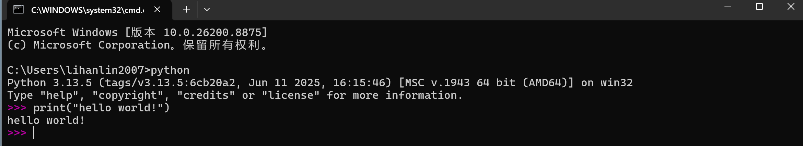


如果要运行多行的 python 程序，最好使用 cat 创建文件并 python + 文件名运行（还可以把 nano 等用起来）

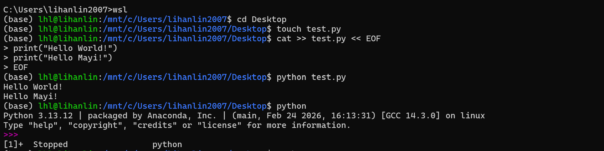


关于 python 和 python3 命令


1. 系统（Ubuntu / Debian / WSL 默认）里：

```bash
which python3
/usr/bin/python3
```

默认只装了 python3（python 指向早期 python2 或已丢失）所以很多 linux / wsl 教程要求使用 python3


2. venv 激活后，它只保证 python 指向自己；python3 没有创建，所以为了使用 venv 环境：

- venv 里永远用 python
- 不要写 python3 main.py（在 venv 里不是好习惯，会在 PATH 中检索到系统 python3）

venv 的激活到底干了什么？

```bash
source venv/bin/activate
```

执行它**唯一的核心动作**是：

> 把虚拟环境的 `bin` 目录，插到 `PATH` **最前面**

```bash
echo $PATH
# 激活前
/usr/bin:/bin:/usr/local/bin

# 激活后
/mnt/c/Users/.../venv/bin:/usr/bin:/bin:...
```


3. 但在 **Conda 环境里**，二者是等价的，Conda 的做法是：
   - 每创建一个环境，都会在里面放一个 `python`
   - 同时也会放一个 `python3`
   - **两者都是软链接，指向同一个可执行文件**


搭配 vscode 来运行 python 程序：

- 搭配 Continue 插件来 enable 代码补全
- 自由使用 linux 命令来配合代码编程

直接点击运行 python 程序，会自动检索 python 解释器，并在**python专用终端**中运行

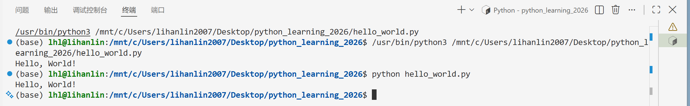

当然也可以在激活了 conda 环境中的 wsl 终端直接使用 python 命令

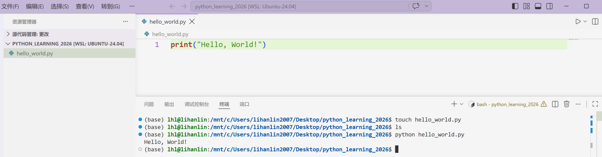


也可以直接使用最轻量级的 IDLE Shell 来编辑、编译运行 python 代码，python 下载的包里面就有：

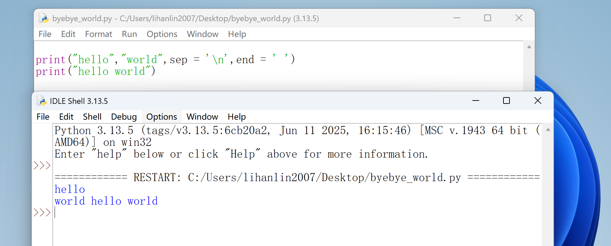

----


## 第二章 变量和数据类型：


变量的赋值

变量 = 字面量，用字面量来标识变量的数据类型


1. 字符串

- **单引号和双引号含义相同**，"Hello" ==  'Hello'，所以可以灵活使用句内单双引号

```py
name = 'hEllo "wolf\'l\'"'  转义即可
```

- **方法**（method）对数据进行操作

  可直接作用在变量上，也可作用在有返回值的函数上，**所有函数都要加上（），哪怕为空**

```py
print(name.title())  # title 方法会严格变成只有首字母大写的字符串
print(name.upper())
```

- **字符串拼接** 直接使用 + 号实现 

```py
print("Hello \"Deepseek\"+name)
```

- **制表符**：`\t`

```py
print("Languages:\n\tPython\n\tJava\n\tKotlin")
```

```py
Languages:
        Python
        Java
        Kotlin
```

- `strip` **删除空白**：只能删除两侧的空白

```python
string.rstrip()   /.lstrip()  /.strip()   # 调用方法会保持原来的字符串不变
string.strip().title()                    # 可以组合调用方法
```

- `removeprefix` **删除前缀**：

```py
string,removeprefix("https://")
```


2. 格式化输出规范

- **首选f-string进行格式化**，f" " 里面的就是格式化目标字符串，会自动将字符串中内容进行格式化转化，比如{}的变量替换 + 冒号格式化转换操作

```py
print(f"say {name}")    # 对最终输出字符串最友好，既格式化，又一次性把各个变量都拼进来
```

```python
1. 整数
x = 3
# 补前导零
print(f"{x:03d}")   # 0表示补零，3是总宽度，d是十进制（宽度不够不截断，总长度只变长）

# 补对齐空格
print(f"{x:5d}")     # 占 5 格，右对齐
print(f"{x:<5d}")    # 左对齐

# 进制转换
x = 255
print(f"{x:b}")      # 11111111
print(f"{x:08b}")    # 11111111 带零宽
print(f"{x:#b}")     # 0b11111111
print(f"{x:x}")      # ff
print(f"{x:X}")      # FF
print(f"{x:o}")      # 377

2. 浮点数

# 保留 k 位小数，银行家舍入规则
x = 3.14159
print(f"{x:.2f}")    # 3.14
print(f"{x:.6f}")    # 3.141590   ← 自动补零

# 银行家舍入 round_half_even 规则：刚好卡在中点上时，五成双（最后的结果位成偶）
def round_half_up(x,k)
	offset = 0.5 if x > 0 else -0.5
	return int(x * (10 ** k) + 0.5) / (10 ** k)

# 截断式舍入，使用类型转换
x = int(x * 10000) / 10000

# 控制总宽度 + 对齐
print(f"{x:8.3f}")   # 占 8 格，右对齐，3 位小数

3. 字符串：宽度 / 截断

print(f"{s:>10}")   # 右对齐，对齐总长度10，如果小于字符串长度直接忽略（不是10个空格）
print(f"{s:10}")    # 默认左对齐
print(f"{s:{width}}")  # width 作为一个变量，支持动态宽度对齐

# 截断（很少用但有用）
print(f"{s:.3}")    # hel


4. 列表

# 一行空格分隔（最常用）

a = [1, 2, 3, 4]

print(' '.join(map(str, a)))   # 1 2 3 4 作用于字符串构成的可迭代对象，比循环更优雅
print(*a)              # 等价，结合 sep 更快
print(' '.join(f"{x:.2f}" for x in a))  # 格式化后再空格分隔

# 二维矩阵
mat = [[1, 23, 4], [555, 6, 7]]
for row in mat:
    print(' '.join(f"{x:>3d}" for x in row))
```

---


### 第三、四章：列表 元组

全量笔记参考“笔记模板大全”


列表的创建  列表元素的访问  

增删改查元素

列表排序


列表的遍历操作

切片访问  复制


元组的不可修改性  元组重新赋值

----


### 第六章 字典 集合


字典的创建方式  字面量  元组列表

字典增删改查

遍历


---


### 第八章 函数

```python
# 将函数存储在模块中，包=文件夹，模块=文件
# 可以导入 模块 / 包.模块 / 从模块导入类、函数

# 导入包，文件在同级目录下
import my_test_module
my_test_module.make_pizza(16,"cheese","eggs")   # 引用时要加点，看 import 的终点

# 导入包，包在文件夹中。目录结构如下：
 my_script.py
 my_package/
     my_module.py
     __init__.py
        
import my_package.my_module
my_module.my_function()

# 或者更好： 
from my_package import my_module 
from my_package.my_module import my_function

# import 的本质是"把某个名字绑定到当前作用域"，右边可以是包、模块、类、函数、变量等**各种 python 对象**，在 import 行为上没有区别，只要自己知道导入的实际是什么

# 只导入函数
from my_test_module import make_pizza
make_pizza(16,"cheese","eggs")

# 导入所有函数
from module import *

# 给包 / 函数使用别名
import torch
import torch.nn as nn
import torch.nn.functional as F
from torch.utils.data import DataSet, DataLoader
```


----

### 第九章 面向对象编程：类

- 类的基本定义：

```py
class Dog:
    
    def __init__(self, name, age):
        self.name = name
        self.age = age

    def sit(self):
        print(f"{self.name} is sitting.")
        
my_dog = Dog("Lucky",1)    # 基于 类 创建 对象
a = my_dog.name            # 访问对象的属性
my_dog.sit()			   # 访问对象的方法 （类中的函数称为方法） 
```

- `__init__` 方法：
  - `__name__` 、`__str__` 等双下划线包裹（Double UNDERscore / 魔术方法）是 python 语言层面保留的特殊命名空间，会主动查找并进行调用
- `_log` 单下划线方法：
  - 这是内部 API，我不保证稳定，你别当公开接口用 / 别在模块外面随便直接调（`from xxx import *` 时，带单下划线的不会被导入） 
  - 开发文档框架 / 库作者本质希望**用户自己写 Handler / Filter**，继承 `Logger` 想改底层行为，你可以 `def _log(...)` 覆盖它

- 双下划线 `__name`（类属性/方法名前，名字改写）：

  - 在类里面定义的 `def __helper(self):` 方法 或  `self.__level` 属性

  - 框架要被继承扩展，就用 `_`；工具类怕被误覆盖，才用 `__`。

```py
class Parent:
    def __init__(self):
        self.__x = 1      # 实际存为 _Parent__x

class Child(Parent):
    def __init__(self):
        super().__init__()
        self.__x = 2      # 实际存为 _Child__x，互不干扰！
# 两个 __x 完全不是同一个属性，子类写啥都不会覆盖父类私有状态
```

- 所以 logging 用 `self._lock`（单下划线），约定"你继承时知道自己在干嘛就可以碰"。

​       反观 `Enum`、`Exception` 基类内部用 `__` 多，因为**用户不该去动它内部实现**。

- 关于 `self` 参数的理解：

```py
self 的本质，就是创建的对象 object 实体 
# <__main__.my_dog object at 0x7f...> 

my_dog.sit()          # 其实是一个语法糖!和下面的写法完全等价
Dog.sit(my_dog)  	  

# python 的绑定传参，当调用到成员方法的语法糖的时候，自动把 object 本体作为第一个参数传到函数里面去。而对于成员属性，则参考如下理解
```

- 对于成员属性的进阶理解：

```py
class Car:
    
    def __init__(self, name, type, year):
        self.name = name
        self.type = type   # 这才理解了参数含义：前面是属性，后面是传入的形 / 实参!! 
        self.year = 0      # 前面是属性，后面不是用传参的方式，而是用一个字面量（默认值）
        
my_car = Car("Audi", C2, 2026)
my_car.year = 2027         # 修改成员属性的值
```

-----

- 字符串相关的魔术方法补充：

- 1. `__str__` vs `__repr__`  （最重要，最常见）快速总结：

- `str(obj)` / `print(obj)` → 调 **`__str__`**（给人看的，好看）
- `repr(obj)` / 交互环境直接敲变量 → 调 **`__repr__`**（给开发者看的，尽量无歧义、能 eval 重建最好）
- **如果没定义 `__str__`，Python 会 fallback 到 `__repr__`**
- **容器（list / dict）打印元素时，永远会用 `repr`**

```python
class User:
    def __init__(self, name, age):
        self.name = name
        self.age = age

    def __repr__(self):
        # 官方推荐格式：类名(参数) ，看起来像构造代码
        return f"User(name={self.name!r}, age={self.age})"

    def __str__(self):
        # 给人看的
        return f"{self.name}({self.age}岁)"

u = User("Alice", 18)

# 在用户交互场景下需要使用对象：
print(u)          # Alice(18岁)        → __str__
print(str(u))     # Alice(18岁)

# 在调试场景下给自己看的：
print(repr(u))    # User(name='Alice', age=18)  → __repr__
u                 # 交互式 REPL 里直接输 → __repr__
```

- `__format__`（f-string / format 的根本底层方法）

- 调用 `f"{obj:>10}"` 或 `"{}".format(obj)` 语句的时候，本质走的是 这个`__format__`魔术方法

```python
class Money:
    def __init__(self, amount):
        self.amount = amount

    def __format__(self, spec):
        # spec 就是冒号后面的部分，比如 "10.2f" 或 "cn"
        if spec == "cn":
            return f"人民币{self.amount:.2f}元"
        if spec == "us":
            return f"USD {self.amount:.2f}"
        # 默认交给 float 去处理格式
        return format(self.amount, spec)

m = Money(123.4)
print(f"{m}")          # ¥123.40       （str）
print(f"{m:cn}")       # 人民币123.40元 （自定义 spec）
print(f"{m:>10.1f}")   #       123.4   （交给 float 处理）
```

logging 里你如果自定义 `Formatter` 或者给 record 加 `extra`，对象支持 `__format__` 后，在 `formatter.format(record)` 里就很丝滑

----

- 类的继承：
- `__init__()` 方法：成员属性的继承

```python
class Car:
    def __init__(self, name, type, year):
        self.name = name
        self.type = type
        self.year = year

# 继承的__init__方法参数必须全部保留，哪怕有不需要的成员属性
class ElectricCar(Car):
    def __init__(self, name, year, battery_size):
        super().__init__(name, type=None, year=year)
        del self.type                		 # 强行不要这个属性
        self.battery_size = battery_size     # 再添加新的属性  
```

- `super().__init__()` 方法的理解

```py
my_e_car = ElectricCar("小米SU7", 2024, 100)  # 基于类创建实例对象

# 在走 super().__init__(...) 方法的时候，相当于使用了一个继承类 Car 的语法糖
Car.__init__(self, ...)
```

- 回到对于 `self` 对象实体的理解：这里的实体就是 E-C  `__init__` 的 `self` 实体对象

  参考下面这段示例代码的运行

  从父类继承了 speak 方法，`super()` 就是隐式把语法糖转换为了 `Animal.speak(self)` 

- 同时这也是一个**重写父类方法**的案例（直接用相同名称函数替代）

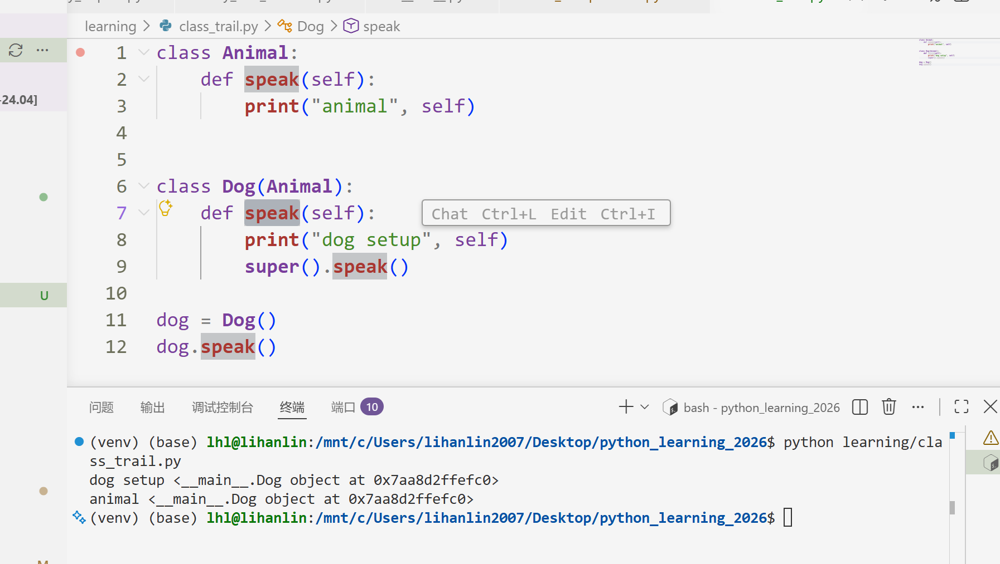 

----

### 第十章 文件和异常


```python
# 提供特定功能的模块，称为**库**
# 从模块导入 Path 类，后续创建一个 Path 类的对象
from pathlib import Path

my_path = Path('pi_digits.txt':str)
# 实战脚本中用到的 Path(__file__) 魔术方法，传入一个字符串，解析为路径

# 读取文件
contents = my_path.read_text().rstrip() -> str

# 相对路径与绝对路径
my_path = Path('files/README.md')         # 默认起点，读取文件所在目录下

# 访问文件中的各行
lines = contents.splitlines()

# 使用字符串拼接，消除换行
pi_string = ''
for line in lines:
    pi_string += line
    
# 写入一行或多行
contents += "\na new line"
my_path.write_text(contents)
```


```python
# 异常基本语句
try:
    print(a/b)
except ZeroDivisionError:
    print("You can't divide by zero!")
else:
	print("The calculator is working correctly!")
   
# 文件访问异常
try:
    print(my_path.read_text().rstrip())
except FileNotFoundError:
    print("The file cannot be opened!")
```


```python
# json格式转换工具
import json

# 将 python 对象倒模成 json 格式，my_path 一直都只是一个对象工具
my_path = Path('my_json.json')
my_path.write_text(json.dumps(my_dict))  -> my_json.json

# 解析 json 格式内容为 python 对象
my_dict = json.loads(my_path.read_text())  -> dict
```


如何读懂 python 中函数的参数标签说明：

- 参数结构   参数名：类型 （ = 默认值 ）
- 两种基本传参方式：位置传参 + 关键字传参
- 从单个 \* 开始，后面的参数只能关键字传参，避免函数功能更新的位置记忆
- 最下面：一句话函数功能说明

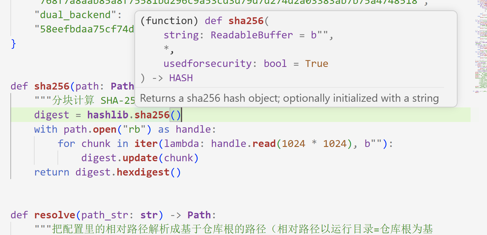

```py
sha256(b"abc", False)           # ❌ 报错！* 后面禁止位置传参
sha256(b"abc", usedforsecurity=False)  # ✅ 必须这样写
```
- **\* args 和 \*\*kwargs 参数**

| **写法**   | **收什么**             | **类型实际是** |
  | :--------- | :--------------------- | :------------- |
  | `*args`    | 所有多余**位置参数**   | `tuple`        |
  | `**kwargs` | 所有多余**关键字参数** | `dict`         |

```python
def foo(*args, **kwargs):
    print(args, kwargs)

foo(1, 2, 3, name="x", age=18)
# args = (1, 2, 3)
# kwargs = {"name": "x", "age": 18}
```

尝试解读 `open` 方法和 `open` 函数：

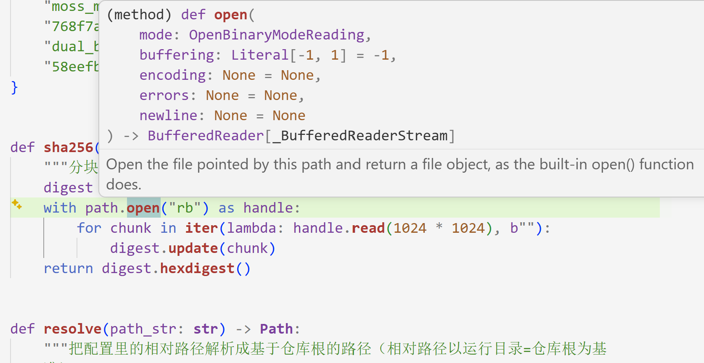


如何理解 `encoding: Bool | None = False` 这种写法？

其实是前面提到的函数参数注解几种写法的重叠：

- `: str | None` 作为一个整体表示类型注解，表示类型既可为 str 也可为空

- 看到这样的类型注解，解释器就会检查代码：
  ```python
  if encoding = None:       # 这样的处理必须先写，否则会报错
      pass             				
  else: ...
  ```

- 默认值还是默认值，只不过这里拿到的默认是 `False` 即可以默认不传这个参数，隐式关闭一个功能，而不是常见的默认 `None` , 也可以传参 `encoding = False` / `encoding = True` 显式来传参开启或者关闭

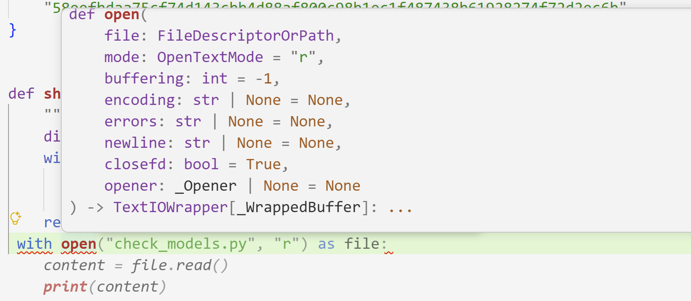


一些 PEP8 的代码风格规范：

- 函数参数默认值，如果不写类型注释的时候，`secure_check=false` 两边不加空格
- 如果加了类型注释，`encoding: string = "utf-8"`

**方式 A：隐式续行，与左括号垂直对齐**

```python
def long_function_name(var_one, var_two, var_three,
                       var_four):
    print(var_one)
```

**方式 B：悬挂缩进（首行不写参数，续行多缩进一级）**

```python
def long_function_name(
        var_one, var_two, var_three, var_four):
    print(var_one)
```

-----

### 实战项目一：手写 my_check_models.py 测试脚本

发了一条朋友圈，文案是这么写的：

``` text
意义非凡，纪念一下
my_check_models.py
```

内涵很深啊，这不只是我第一次看 AI 的代码，并且真正把 AI 写的用最近学的 python 知识全部理解、甚至找到 AI 代码中的三个错误！！而且这个程序还是我自己敲出来的哦！！没有 Ctrl^C、没有 Bypass Permission、甚至没有 Continue & Tab！！

my_check_models，这个名字仿佛也有别样的寓意，是第一个在项目中实用起来、最终真的调试看到 ALL CHECK PASS 的实战检查 model 的脚本，更是“我、check、model”的实践！沉稳、自信，相信这终会成为你最稀缺的那个特性。

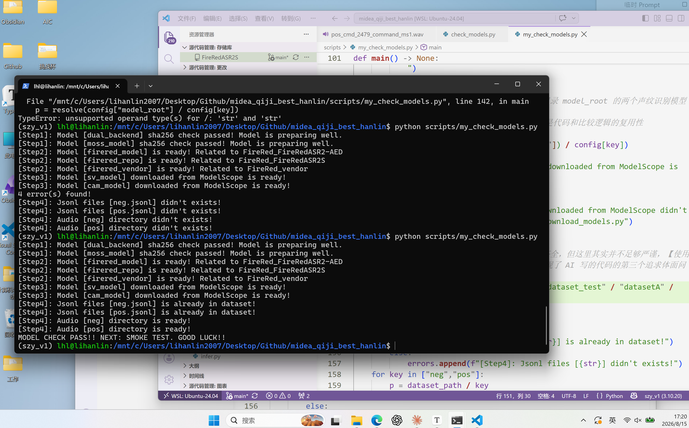


----

### 实战项目二：AATTS 回追：简单多文件系统


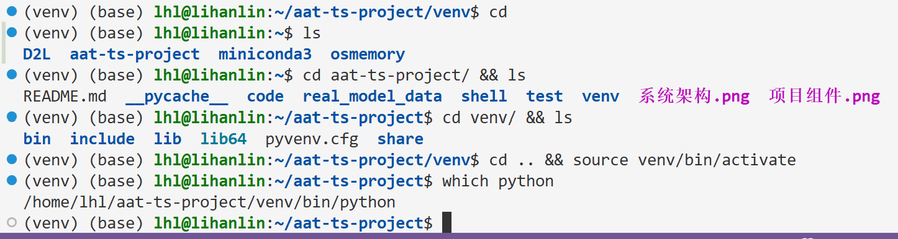
